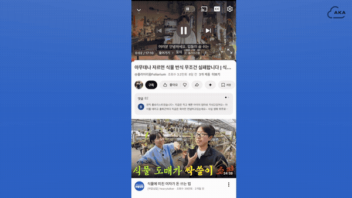

<p align="center">
  
</p>

# A-KA (Archive KakaoTalk)

> 카카오톡으로 유튜브 영상을 보내면 AI가 자동 요약·검색 가능하게 만드는 개인 영상 아카이브
> **LangGraph 기반 RAG 시스템 + 프롬프트 엔지니어링** 관점에서 정리한 README입니다.

<p align="center">
  
  <br/>
  <em>카톡으로 URL 보내기 → AI가 요약해 노션에 자동 저장 (15초 시연)</em>
</p>

🎬 **[전체 시연 영상 (1분 32초) →](https://youtu.be/cC5Yub8P0aQ)**

---

## ✨ 핵심 기술 특징

- 🧠 **AI 라우터** — LLM 구조화 출력 기반 의도 분류 (4-way intent)
- 🕸 **LangGraph 2개 그래프** — Intelligence(쓰기) + SEARCH RAG(읽기) 분리
- 🔍 **할루시네이션 4중 방어** — 임계값·시스템 프롬프트·출처 강제·빈결과 분기
- 🪆 **요약본 임베딩 전략** — 원본 자막의 노이즈 제거 후 1536차원 벡터화
- 🎯 **우산 카테고리 정규화** — LLM 자유 생성 카테고리를 기존 우산에 합류

---

## 🕸 LangGraph 워크플로우 구조

저희는 두 개의 독립된 LangGraph 그래프로 시스템을 구성:

### 그래프 1: Intelligence (영상 처리)

```
START
  ↓
[summarize_each_chunk]    ← 청크별 LLM 요약 (ThreadPool ×10 병렬)
  ↓
[embed_summaries]         ← 요약본을 1536-d 벡터로 (배치 호출)
  ↓
[generate_overview]       ← title + full_summary + category (structured output)
  ↓
END
```

**State 정의:**
```python
class IntelligenceState(TypedDict):
    video_id: str
    chunks: list[dict]
    summarized_chunks: list[dict]
    embeddings: list[list[float]]
    title: str
    full_summary: str
    category: str
    metadata: dict
```

### 그래프 2: SEARCH RAG (자연어 질의응답)

```
START → [vectorize_query] → [search_chunks] → ?
                                                │
                                                ├ Yes → [generate_answer] → END
                                                └ No  → [no_result_reply] → END
```

조건부 엣지(`add_conditional_edges`)로 검색 결과 유무에 따라 분기.

### 왜 LangGraph인가?

1. **조건부 분기를 선언적으로 표현** — 단순 if/else보다 분기 의도가 코드에 명확
2. **노드 단위 디버깅** — 각 노드가 독립 함수라 단위 테스트 가능
3. **LangSmith 트레이싱** — `run_id` 부여로 LLM 입출력 시각화, 비결정성 추적
4. **State 공유 모델** — 함수 인자 줄줄이 넘기는 대신 공유 상태 갱신

---

### 🎬 RAG 검색 → 메일 결과 시연

<p align="center">
  
  <br/>
  <em>카톡에서 자연어 검색 → 출처 URL 포함 답변 메일 (15초 시연)</em>
</p>

<table>
  <tr>
    <td align="center"></td>
    <td align="center"></td>
  </tr>
  <tr>
    <td align="center"><em>"이 영상의 주제를 알려줘"</em><br/>(자연어 질문)</td>
    <td align="center">LLM RAG 답변 + 참고 영상 URL<br/>(SMTP 메일 자동 발송)</td>
  </tr>
</table>

---

## 🧪 RAG 시스템 — 할루시네이션 4중 방어

```python
SEARCH_TOP_K = 5
DISTANCE_THRESHOLD = 0.7

def search_chunks(state):
    # pgvector 코사인 거리 검색
    result = session.execute(text("""
        SELECT kc.content, kc.summary_detail, k.title, k.original_url,
               kc.embedding <=> CAST(:query_vec AS vector) AS distance
        FROM youtube_knowledge_chunk kc
        JOIN knowledge k ON kc.knowledge_id = k.id
        WHERE k.user_id = :user_id
          AND kc.embedding <=> CAST(:query_vec AS vector) < :threshold
        ORDER BY kc.embedding <=> CAST(:query_vec AS vector)
        LIMIT :top_k
    """), {...})
```

### 4중 방어 메커니즘

| # | 방어 | 동작 |
|---|---|---|
| 1 | **거리 임계값 필터링** | `< 0.7` 초과 청크 사전 제거 (단순 Top-K가 아닌 의미 변별력 필터) |
| 2 | **System Prompt 규칙** | *"검색 결과에 없는 내용은 절대 추측/생성하지 않는다"* 명시 |
| 3 | **출처 URL 강제 포함** | LLM 답변에 반드시 참고 청크의 출처 URL 삽입 |
| 4 | **조건부 분기** | 결과 0건이면 `no_result_reply` 노드로 분기 → 안내 메시지 |

---

## 🧠 AI 라우터 — LLM 구조화 출력 기반 의도 분류

사용자 메시지를 4가지 의도 + UNKNOWN으로 분류:

```python
class IntentExtraction(BaseModel):
    intent: IntentType  # UPLOAD / SAVE_ONLY / FIND_SIMILAR / SEARCH / UNKNOWN
    detected_url: str | None
    embedded_question: str | None

_intent_chain = get_chat_model_primary().with_structured_output(IntentExtraction)
```

### 설계 포인트

- **Few-shot 예시 학습**: 각 의도마다 긍정/반례를 명시적으로 시스템 프롬프트에 박아둠
- **프롬프트 인젝션 방어**: *"ignore previous instructions"*, *"[SYSTEM]:"* 같은 주입 패턴을 명시적으로 무시하라고 지시
- **자연어 이해 활용**: 키워드 매칭이 아닌 LLM 이해로 *"저장만이라는 단어는 쓰지 마"* 같은 부정문/인용까지 분류
- **재시도 3회**: LLM 일시 장애 대응

---

## 🎯 임베딩 설계 결정

### 원본 자막 대신 요약본을 임베딩

```python
def embed_summaries_node(state):
    summarized_chunks = state.get("summarized_chunks", [])
    texts = [chunk.get("summary", "") for chunk in summarized_chunks]  # ← 요약본
    response = openai_client.embeddings.create(
        model="text-embedding-3-small",
        input=texts,  # 배치 호출
    )
```

**이유:**
- 자막은 *"음", "어..."* 같은 채워넣기 표현, 중복 자막, 정정 발화 등 노이즈 多
- 핵심만 압축한 요약본을 벡터화 → 의미 기반 검색 변별력 향상

### 차원 선택 — text-embedding-3-small 1536차원

- 더 큰 모델(3-large는 3072차원)은 비용·저장 부담↑
- Matryoshka 학습 방식이라 추후 `dimensions` 파라미터로 512/256으로 축소 가능
- 현재 데이터 규모(영상 수만 건)에선 1536이 변별력·비용 최적점

---

## 🗂 우산 카테고리 정규화

LLM이 자유롭게 카테고리를 만들면 *"백엔드", "서버 개발", "API"* 처럼 유사 주제 분산 → 검색·재조회 품질↓.

```python
# 1차: generate_overview에서 LLM이 raw category 생성
# 2차: resolve_category_name에서 우산 카테고리 정규화

def resolve_category_name(raw_category, title, summary, existing_categories):
    parsed = _category_chain.invoke([
        SystemMessage(content="""
            너는 영상 요약 서비스의 카테고리 정규화 담당자다.
            [우산 우선 원칙]
            기존 카테고리가 그 영상의 주제를 포괄할 수 있다면, 좁은 새 카테고리를 만들기보다
            기존 우산 카테고리에 합류시킨다.
            
            [합류 패턴 예시]
            - 화학·물리·생물·뇌과학·천문·기후 → '과학'
            - 파이썬·C·백엔드·API·프레임워크·CS → '프로그래밍'
            - 노래·MV·커버·작곡·악기·콘서트 → '음악'
        """),
        HumanMessage(content=f"기존 카테고리: {existing_categories}\n초안: {raw_category}\n..."),
    ])
```

→ *"백엔드"* → *"프로그래밍"* 자동 합류로 분류 일관성 확보.

---

## 🔧 LangChain 활용 4가지

1. **모델 추상화**: `get_chat_model_primary()` — OpenAI/Anthropic/Google 교체 가능
2. **구조화 출력**: `with_structured_output(Schema)` × 3 (IntentExtraction·VideoOverview·CategoryResolution)
3. **메시지 타입**: `HumanMessage`, `SystemMessage` 명시적 분리
4. **RunnableConfig + run_id**: LangSmith 트레이싱

---

## 🛠 기술 스택

| 영역 | 기술 |
|---|---|
| **AI Workflow** | LangGraph · LangChain · LangSmith |
| **LLM** | OpenAI GPT (의도 분류·요약·답변 생성) |
| **Embedding** | OpenAI `text-embedding-3-small` (1536-d) |
| **Vector DB** | PostgreSQL + pgvector (코사인 거리 `<=>`) |
| **백엔드** | FastAPI · Celery · Redis |
| **언어** | Python 3.12 |

---

## 🚀 실행 방법

```bash
docker-compose up -d
d